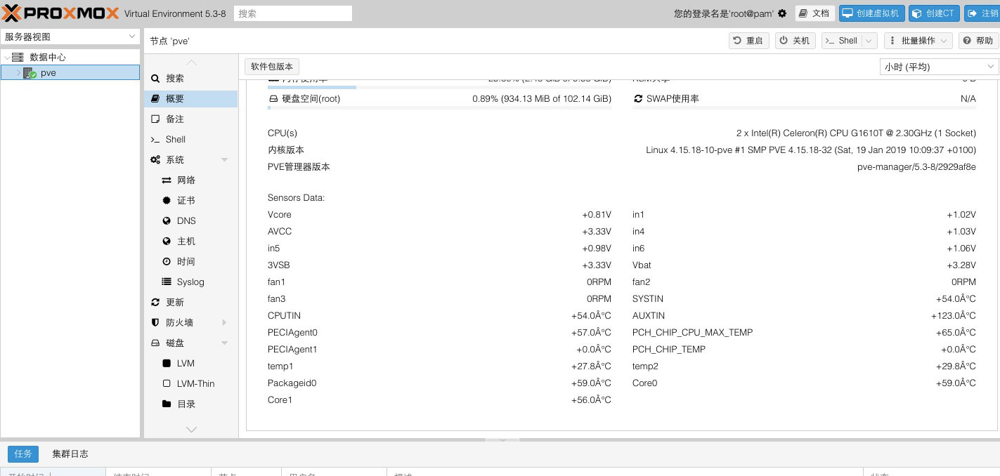

>This is a Sensors's interface install in proxmox ve 5.3/5.4 shell script.

## install guide ##

1. clone or download the code to your proxmox ve. `git clone https://github.com/ivanhao/PveSensors.git`
2. cd to the path
3. execute the `chmod +x ./*.sh` command to make it have right permission to execute the install or uninstall.
4. `./install.sh` to install.
> Don't forget to make a snapshot for rpool before run it.

> you must run this script as `root`.

## uninstall guide ##
`./uninstall.sh`
or
rollback your zfs rpool's snapshot and reboot.

***

>这是一个在proxmox ve 5.3/5.4中安装Sensors传感器值显示界面的脚本

## 安装说明 ##
#### 如果这个脚本帮到你了，麻烦点一下右上角的star小星星^_^

1. clone或下载安装包到proxmox ve里，例如在/root目录运行：`git clone https://github.com/ivanhao/PveSensors.git`。
2. 命令行cd到安装包的路径里。
3. 执行`chmod +x ./*.sh`来让程序有执行的权限。
4. `./install.sh`来安装，根据提示很快就完成了。然后刷新界面。
> 不要忘记执行前给rpool做个快照，以便恢复快照。

> 需要用root账号来运行

## 卸载 ##

`./uninstall.sh` 来卸载。
或者
回滚你的rpool快照，重启。

##  Preview 预览 ##

## 写代码辛苦，如果觉得好的请捐赠一下，自愿捐赠五毛一块的你也没啥损失，我也不会发大财，但是是对我的一种鼓励^_^

感谢以下人士的捐赠：

qq昵称：思玉

qq昵称：昆仑
